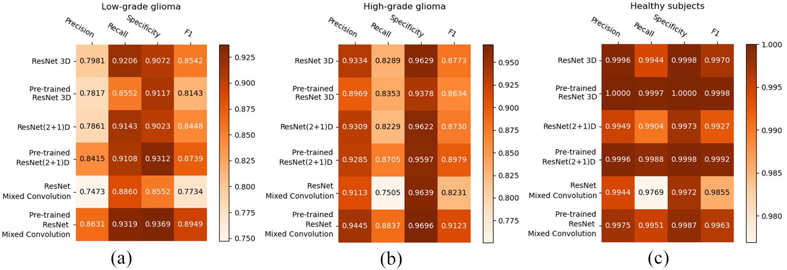

# Classification-of-brain-tumor-using-Spatiotemporal-models

##### Overview: #####

Classifying tumours using such deep learning methods has made significant progress with the availability of open datasets with reliable annotations. 
Typically those methods are either 3D models, which use 3D volumetric MRIs or even 2D models considering each slice separately. However, by
treating one spatial dimension separately or by considering the slices as a sequence of images over time, [spatiotemporal 
models (Tran et al.)](https://arxiv.org/pdf/1708.05038.pdf) can be employed as "spatiospatial" models for this task. These models have the capabilities of learning specific spatial
and temporal relationship, while reducing computational costs. This is an implementation of two spatiotemporal models, ResNet (2+1)D
and ResNet Mixed Convolution, and 3D Convolutions, to classify high-grade glioma, low-grade glioma, and healthy brain MR Images. 

<p align="center">

</p>

##### Getting started: #####

Execute ```run.py```, you can change the hyperparameters and settings for your experiments by overriding them in ```configs/config.yaml``` file or overriding through command line example: ```python run.py training.batch_size=2``` for multirun use ```-m``` flag, ```python run.py -m training.batch_size=2,5,10```.

##### Dataset: #####

The original implementation of this work was done using [BraTS 2019](https://www.med.upenn.edu/cbica/brats2019/data.html) dataset (T1 contrast enhanced images) with high-grade and low-grade glioma samples, and using [IXI](https://brain-development.org/ixi-dataset/) (T1 images), the healthy brain images. The IXI samples were skull-stripped and resampled to be used as non-pathological images for the classification task. 

##### Results: #####

<p align="center">

</p>


##### Preprint: #####
[Soumick Chatterjee, Faraz Ahmed Nizamani, Andreas Nürnberger, and Oliver Speck, Classification of Brain Tumours in MR Images using Deep Spatiospatial Models](https://arxiv.org/pdf/2105.14071.pdf)

BibTeX:
```
@article{chatterjee2021classification,
  title={Classification of Brain Tumours in MR Images using Deep Spatiospatial Models},
  author={Chatterjee, Soumick and Nizamani, Faraz Ahmed and N{\"u}rnberger, Andreas and Speck, Oliver},
  journal={arXiv preprint arXiv:2105.14071},
  year={2021}
}
```

This work was in part conducted within the context of the International Graduate School MEMoRIAL at Otto von Guericke
University (OVGU) Magdeburg, Germany, kindly supported by the European Structural and Investment Funds (ESF) under the
programme "Sachsen-Anhalt WISSENSCHAFT Internationalisierung" (project no. ZS/2016/08/80646).


